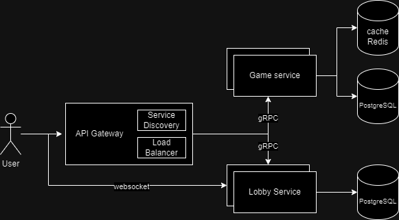

# Online Sudoku Platform

## Project Description
An online Sudoku platform where users can play Sudoku games, track their progress, and participate in lobbies for game sessions. The platform uses a microservice architecture, ensuring scalability and separation of concerns. The two main microservices focus on user/game management and game lobby management through WebSocket communication.

## Application Suitability

### Relevance of Microservices Architecture
Microservices architecture is suitable for the Online Sudoku Platform because:

1. **Scalability**: The platform needs to handle multiple users simultaneously playing games, joining lobbies, or tracking progress. Microservices allow independent scaling of game and lobby services.
   
2. **Independence**: By separating concerns, the lobby and game management systems can be developed, deployed, and scaled independently. This approach reduces complexity and allows for better resource allocation.

3. **Real-time Capabilities**: The lobby service requires real-time communication between players, which can be efficiently handled using WebSockets. This separation enables independent development of WebSocket functionality without affecting the game logic.

### Real-World Examples
1. **Chess.com**: Chess.com employs a similar architecture to handle multiplayer lobbies, real-time gameplay, and user management. Each service handles specific tasks, allowing for independent development and scaling during peak usage.
   
2. **TicTacToe Multiplayer (Google)**: Google uses WebSocket-based real-time communication for multiplayer games, providing instant feedback to players across different regions while maintaining separate services for game logic and session management.

## Service Boundaries
The platform is divided into two core microservices:

1. **Game Service**: Handles user registration, game management, and Sudoku logic (validating inputs, game state management, score tracking).
   
2. **Lobby Service**: Manages game sessions, allowing users to join lobbies, receive updates, and interact with other players using WebSocket communication.

### System Architecture Diagram
The architecture would consist of the following elements:

- **API Gateway** (written in C#): Central entry point for all requests, routing them to the appropriate microservice.
- **Load Balancer**: Distributes incoming requests across multiple instances of each microservice for better availability.
- **Game Service** (Python with FastAPI): Handles user and game management. Exposes RESTful endpoints for user authentication, game state, and score tracking.
- **Lobby Service** (Python with FastAPI and WebSocket): Manages game sessions, enabling real-time communication via WebSocket.
- **Database**: Each microservice has its own database to avoid cross-service data dependencies. Game Service uses PostgreSQL, and Lobby Service uses Redis for session management.
  


## Technology Stack and Communication Patterns
- **Game Service**:
  - **Language**: Python (FastAPI)
  - **Database**: PostgreSQL
  - **Communication**: RESTful API for client interactions, gRPC for inter-service communication with the Lobby Service.

- **Lobby Service**:
  - **Language**: Python (FastAPI)
  - **Communication**: WebSocket for real-time communication with clients, RESTful API for other operations.
  - **Database**: Redis for real-time session management.

- **API Gateway**:
  - **Language**: C#
  - **Communication**: Routes RESTful requests from the client to the appropriate microservice, handles load balancing.

### Communication Patterns
1. **RESTful API (Game Service)**: Standard HTTP requests for user management and game state.
2. **WebSocket (Lobby Service)**: Handles real-time communication between users in game lobbies.
3. **gRPC**: Used for inter-service communication between the Game and Lobby services, ensuring high performance and low-latency communication for game session management.

## Data Management Design
Each microservice will maintain its own database, ensuring separation of concerns. The Game Service uses PostgreSQL, while the Lobby Service uses Redis for lightweight, real-time session data storage.

### Endpoints
- **Game Service (FastAPI)**:
  - **POST /users/register**: Registers a new user.
    - Request:
      ```json
      {
        "username": "string",
        "password": "string"
      }
      ```
    - Response:
      ```json
      {
        "message": "User registered successfully."
      }
      ```
  
  - **POST /users/login**: Authenticates a user and returns a token.
    - Request:
      ```json
      {
        "username": "string",
        "password": "string"
      }
      ```
    - Response:
      ```json
      {
        "token": "string"
      }
      ```

  - **POST /games/start**: Starts a new Sudoku game.
    - Request:
      ```json
      {
        "difficulty": "easy | medium | hard"
      }
      ```
    - Response:
      ```json
      {
        "gameId": "string",
        "board": "[[0,0,0,5,0,0,0,0,0],...]"
      }
      ```

  - **POST /games/{gameId}/move**: Submits a move.
    - Request:
      ```json
      {
        "row": "int",
        "col": "int",
        "value": "int"
      }
      ```
    - Response:
      ```json
      {
        "message": "Move accepted."
      }
      ```

  - **GET /games/{gameId}**: Retrieves the current game state.
    - Response:
      ```json
      {
        "gameId": "string",
        "board": "[[0,0,0,5,0,0,0,0,0],...]"
      }
      ```

- **Lobby Service (FastAPI + WebSocket)**:
  - **POST /lobbies**: Creates a new lobby for users to join.
    - Request:
      ```json
      {
        "gameId": "string"
      }
      ```
    - Response:
      ```json
      {
        "lobbyId": "string",
        "message": "Lobby created."
      }
      ```

  - **GET /lobbies/{lobbyId}**: Fetches the details of a specific lobby.
    - Response:
      ```json
      {
        "lobbyId": "string",
        "gameId": "string",
        "players": ["user1", "user2"]
      }
      ```

  - **WebSocket /lobbies/ws**: WebSocket endpoint for real-time communication.
    - Request:
      ```json
      {
        "action": "join_lobby",
        "lobbyId": "string",
        "userId": "string"
      }
      ```
    - Response:
      ```json
      {
        "status": "success",
        "message": "User joined the lobby."
      }
      ```

## Deployment and Scaling
Both microservices will be containerized using **Docker**. The platform will use **Docker Compose** to orchestrate multiple containers (Game Service, Lobby Service, Redis, PostgreSQL, and API Gateway).

### Horizontal Scaling
To handle increased load, we can deploy additional instances of the Game and Lobby services. This will be managed through the **Load Balancer** in front of the API Gateway.

- **Docker Compose** will handle service orchestration, ensuring each container is part of a shared network.
  
### Scaling WebSocket Connections
WebSocket-based services (like the Lobby Service) will be scaled by increasing the number of WebSocket instances, using Redis to handle session persistence.

### Load Balancer
The **Load Balancer** will be written in C# and integrated into the API Gateway. It will distribute incoming requests evenly across multiple instances of each microservice, ensuring high availability.
